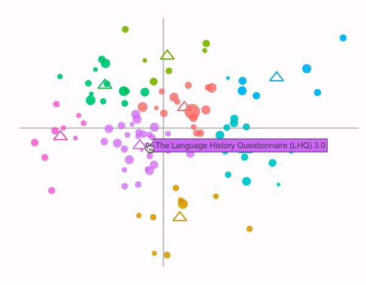

```{r setup, include=FALSE}
knitr::opts_chunk$set(echo = TRUE, message = FALSE, warning = FALSE)
```

---

The Semantic Librarian is an R Shiny App developed by [Matthew Crump](https://crumplab.github.io) (Brooklyn College of the City University of New York), [Randall Jamieson](https://umcognitivesciencelaboratory.weebly.com), Matt Cook (University of Manitoba), and [Harinder Aujla](http://ion.uwinnipeg.ca/~haujla/) (University of Winnipeg). We use a vector-space model of word-semantics to all a user to search a set of documents by their semantic similarity. A current version of the app can be found here [https://crumplab.shinyapps.io/SemanticLibrarian](https://crumplab.shinyapps.io/SemanticLibrarian). This version used select experimental journals from the APA (American Psychological Association) corpus, published between the 1890s and 2016.

This blog will record some further examination and analyses of the APA database. 

## The Database

The list of journals is:

```{r, results='asis'}
load("../allData/allData.RData", envir=.GlobalEnv)
the_journals <- levels(article_df$journal)
for(i in 1:length(the_journals)){
 cat("- ",the_journals[i], sep="")
 cat("\n")
}
```

There were a total of `r dim(article_df)[1]` abstracts, `r length(author_list)` authors, and the corpus consisted of `r length(dictionary_words)` words. We used BEAGLE [@jones2007representing] to create semantic vectors for each word. Then we created abstract vectors for each article by adding the word vectors together (that were in each article). We also created vectors for each author, as the sum of their abstract vectors. This way, all of the words, abstracts, and authors, can be projected into the same high-dimensional semantic space. As a result, it is possible to compute the semantic similarity between any word, abstract, or author. This blog explores some of these relationships.

## Top 10 abstracts

5/29/2019

What are the top 10 abstracts published in these APA journals? Who knows. What would the measure be?

How about a different question, which 10 abstracts are the most similar to all other abstracts? Let's find out. Below is a table of the top 10 abstracts that have the highest mean similarity to all of the other abstracts. To find this, I computed the cosine similarity between each abstract vector and every other abstract vector. That results in a 27560 x 27560 similarity matrix. Each column represents the similarities of an article to all the other articles. I computed the mean for each column, then below, I list the top 10 with the largest means.

```{r}
load("article_df.RData")
library(dplyr)
top_10_articles <- article_df %>%
                    arrange(desc(mean_sim)) %>%
                    slice(1:10) %>%
                    mutate(mean_sim = round(mean_sim,digits=3)) %>%
                    select(title,authorlist,journal,year, mean_sim)
knitr::kable(top_10_articles)
```

Interesting. I've read a couple of these papers over the years. Estes (1976) is a classic. Whittlesea, Brooks, and Westcott (1994) is a fantastic paper, kind of surprised to see it pop up here. 

In many ways I'm not sure what to make of this information. The similarities are all around .93. The abstracts span many years of publication, and multiple journals are represented. Did all of these articles have the same kind of impact on the field? The database currently does not have citation information, and that would be worth adding at some point. At the very least, it wasn't clear to me before doing this whether the top 10 most similar abstracts would be "good" papers, representing something centrally important about these domains, or whether they would be derivative papers, that are like many other papers, but perhaps not as noteworthy. 

### Most similar papers by year

How about one more table. Let's look at the most similar abstracts for each year. Within in each year, I found the paper that had the highest mean similarity to all other papers (across all years). The table below shows the top papers (highest similarity to the set) across the last 50 years.

```{r}

top_10_articles_year <- article_df %>%
                        arrange(desc(year)) %>%
                        group_by(year) %>%
                        filter(mean_sim == max(mean_sim)) %>%
                        ungroup() %>%
                        slice(1:50) %>%
                        select(title,authorlist,journal,year, mean_sim)

knitr::kable(top_10_articles_year)
```

Again, not really sure what to make of this list. Some of these papers are familiar to me, some are not. At the very least, this is a data-driven measure of something about these abstracts, but there were also many assumptions built into the construction of the semantic vectors, and it remains unclear how those assumptions would change the outcome here. Nevertheless, it is interesting to speculate that this kind of approach yields information about the quality of articles, in a similar way to the citation analysis used by @cho2012citation, to create a list of top papers in cognitive psychology. 

## Semantically distinct abstracts

5/30/2019

What are the most semantically distinct abstracts? These might the abstracts with the lowest mean similarity to all other abstracts. In that sense, these abstracts are the ones that are furthest away from the others in semantic space; so they are distinct in terms of their differentness to the entire set. Let's look at the top 25 and see what we get.

```{r}
top_25_distinct <- article_df %>%
                    arrange(mean_sim) %>%
                    slice(1:25) %>%
                    mutate(mean_sim = round(mean_sim,digits=3)) %>%
                    select(title,authorlist,journal,year, mean_sim)
knitr::kable(top_25_distinct)
```

Ok, not really what I was looking for, but sensible. The database contains many entries that are not normal abstracts for empirical papers. They could be editorials by incoming editors, obituaries, and apparently, abstracts not written in English. So, it makes sense that the abstracts above are the kind of abstracts that are most dissimilar to the entire set, which is mostly composed of abstracts for empirical papers.

To look at the abstracts for regular articles, I suppose the database could be tagged, but there are too many entries for me to do that right now. Let's take a look at the distribution of mean similarity values first, and then perhaps decide to exclude the really rare and weird abstracts based on some exclusion criterion.

```{r}
library(ggplot2)
ggplot(article_df, aes(x=mean_sim)) +
  geom_histogram(bins=100, size=1, color="white") +
  xlab("Mean Similarity")+
  ggtitle("Histogram of mean similarity between each article and every other article")
```

It's too small to see, but there are some abstracts that span the range into the lower values. Let's take a look at the 25 articles with the lowest mean similarity, starting with a cutoff of .7.

```{r}
top_25_distinct <- article_df %>%
                    arrange(mean_sim) %>%
                    filter(mean_sim > .7) %>%
                    slice(1:25) %>%
                    mutate(mean_sim = round(mean_sim,digits=3)) %>%
                    select(title,authorlist,journal,year, mean_sim)
knitr::kable(top_25_distinct[1:5,])
```


I'll spare the reader, and only show the top 5--still abstracts not related to regular papers. Let's start at .8 instead.

```{r}
top_25_distinct <- article_df %>%
                    arrange(mean_sim) %>%
                    filter(mean_sim > .8) %>%
                    slice(1:25) %>%
                    mutate(mean_sim = round(mean_sim,digits=3)) %>%
                    select(title,authorlist,journal,year, mean_sim)
knitr::kable(top_25_distinct)
```

Ok, now we are starting to look at more regular articles. And, what do we see? It seems like mainly older articles. Perhaps not surprising. There are fewer of those in the set, and their abstract lengths are typically shorter than newer articles. 

## Central articles and different metrics

I previously used mean similarity to look at "central" articles. Let's use a few more descriptive statistics to get at similar issues. There's a whole bunch of things to try here. I'm going to start with two things. For example, what if we divide mean similarity, by the standard deviation? There's some good reasons to do that. But before that, let's look first at the standard deviation.

### Articles with highest standard deviation

Using the cosine similarity matrix, I computed the standard deviation of similiarity scores in each column. This gives a measure of dispersion for each article. What do the top 25 articles with the lowest standard deviation look like? Whatever these articles are, they are surrounded the most tightly by the other articles. 

```{r}
top_25_sd <- article_df %>%
                    arrange(sd_sim) %>%
                    slice(1:25) %>%
                    mutate(sd_sim = round(sd_sim,digits=3)) %>%
                    select(title,authorlist,journal,year, sd_sim)
knitr::kable(top_25_sd)

```

Well, I don't think I'll be going and reading these articles. The top 25, with the lowest standard deviation appear to be mostly older papers.

Now, what I really wanted to do was to divide the mean similarities, by the standard deviations; then looks at the papers with the highest values. Papers with the highest values will be the ones with larger mean similarity, and small standard deviation. These are the kinds of papers that are perhaps the most central inside the set. They are the closest to all other papers, and they surrounded more closely by the other papers.

```{r}
top_50_mean_sd <- article_df %>%
                    mutate(mean_sd = mean_sim / sd_sim) %>%
                    arrange(desc(mean_sd)) %>%
                    slice(1:50) %>%
                    mutate(mean_sd = round(mean_sd,digits=3)) %>%
                    select(title,authorlist,journal,year, mean_sd)
knitr::kable(top_50_mean_sd)

```


Huh. Wasn't expecting this kind of list. Lots of older papers, and a very different list from the earlier section looking at highest mean similarity. Still, curious to look at this same thing by year. So, the next table find the articles withe highest value (mean similarity divided by standard deviation) in each year. I'll show the last 50 years:

```{r}

top_50_articles_year <- article_df %>%
                        mutate(mean_sd = mean_sim / sd_sim) %>%
                        arrange(desc(year)) %>%
                        group_by(year) %>%
                        filter(mean_sd == max(mean_sd)) %>%
                        ungroup() %>%
                        slice(1:50) %>%
                        select(title,authorlist,journal,year, mean_sd)

knitr::kable(top_50_articles_year)
```

## Looking at the journals

### Psychological Review

I'm going to take a first stab at looking into specific journals. Let's start with Psychological Review, a well-respected journal. First, let's look at the top 50 papers in Psych review with the highest mean similarities to all other abstracts across all journals:

```{r}
psych_review_top_50 <- article_df %>%
                        filter(journal == "Psychological Review") %>%
                        arrange(desc(mean_sim)) %>%
                        slice(1:50) %>%
                        select(title,authorlist,journal,year, mean_sim)

knitr::kable(psych_review_top_50)
```

Some good papers in there, but hey, it's Psych Review. Another aspect is to look entirely within Psych review papers. So, rather than finding which papers in Psych Review are most similar to all other papers, let's just find the papers that are most similar to the other papers in Psych Review.

```{r}
load("psyc_review_df.RData")
psych_review_top_50_w <- psyc_review_df %>%
                        arrange(desc(pr_sims)) %>%
                        slice(1:50) %>%
                        select(title,authorlist,journal,year, mean_sim)
knitr::kable(psych_review_top_50_w)
```

Well, it's another different list, and more tea-leaf reading. Without other metrics to validate these measures against it's not clear what is being measured.

## Journals over Time

I'll come back here to say more about this when I have the tools to say more. The question is about how the semantic structure of the database changes over time. I have to think more about ways to answer this question.

For now, here is an animation of publications in the different journals over time. The color of the dots represents different journals. More to follow when I get the chance.

```{r}

```


## Top 100 most similar authors

Let's a look at the most "central" authors in the database. To do this, I computed the similarity between each author and every other author. Every author has a semantic vecctor, which is the sum of their abstract vectors. I created the author similarity matrix, and the found the column means. Then I found the top 100 authors with the highest mean similarity. Below is a 2-d plot using multi-dimensional scaling, showing the top 100 authors.

```{r, eval = FALSE}
load("author_mean_sims.RData")

names(author_mean_sims) <- author_list
author_mean_sims <- sort(author_mean_sims, decreasing=T)
#author_mean_sims[1:100]

library(RsemanticLibrarian)

top_author_names <- names(author_mean_sims)[1:100]
author_ids <- which(author_list %in% top_author_names == TRUE)
restricted_author_vecs <- AuthorVectors[author_ids,]
row.names(restricted_author_vecs)<-NULL
library(lsa)
top_author_sims <- cosine(t(restricted_author_vecs))

fits <- cmdscale(1-top_author_sims,eig=TRUE, k=2)
cluster <- kmeans(fits$points,10)
fit_df <- data.frame(fits$points,authors = names(author_mean_sims[1:100]),
                     Similarity = author_mean_sims[1:100],
                     cluster = as.factor(cluster$cluster))
```

```{r, fig.width=10, fig.height=5, eval=FALSE}
library(ggrepel)
ggplot(fit_df, aes(x=X1, y=X2, color = cluster,
                                label=authors))+
        geom_hline(yintercept=0, color="grey")+
        geom_vline(xintercept=0, color="grey")+
        geom_point(aes(size=Similarity), alpha=.75)+
        geom_text_repel(aes(size=Similarity),color="black", force=1.5)+
        scale_size(range = c(4, 8))+
        theme_void()+
        theme(legend.position = "none")+
        ggtitle("APA authors (1890s-2016, Experimental Journals) with highest semantic similarity to other authors")+
        theme(plot.title = element_text(size = 30, face = "bold"))
```


```{r}

```

Well, there they are. Lots of recognizable authors. Daniel Kahneman had the highest mean similarity. He is not in the center, as you might expect. This is partly due to the multi-dimensional scaling solution. The mean similarities for each author are captured by the size of the dot. 

### top 200

And for fun, here are the next 100 (101- 200) authors with the highest mean similarity.

```{r, eval =FALSE}
load("author_mean_sims.RData")

names(author_mean_sims) <- author_list
author_mean_sims <- sort(author_mean_sims, decreasing=T)
#author_mean_sims[1:100]

library(RsemanticLibrarian)

top_author_names <- names(author_mean_sims)[101:200]
author_ids <- which(author_list %in% top_author_names == TRUE)
restricted_author_vecs <- AuthorVectors[author_ids,]
row.names(restricted_author_vecs)<-NULL
library(lsa)
top_author_sims <- cosine(t(restricted_author_vecs))

fits <- cmdscale(1-top_author_sims,eig=TRUE, k=2)
cluster <- kmeans(fits$points,10)
fit_df <- data.frame(fits$points,authors = names(author_mean_sims[101:200]),
                     Similarity = author_mean_sims[101:200],
                     cluster = as.factor(cluster$cluster))
```

```{r, fig.width=10, fig.height=5, eval=FALSE}
library(ggrepel)
ggplot(fit_df, aes(x=X1, y=X2, color = cluster,
                                label=authors))+
        geom_hline(yintercept=0, color="grey")+
        geom_vline(xintercept=0, color="grey")+
        geom_point(aes(size=Similarity), alpha=.75)+
        geom_text_repel(aes(size=Similarity),color="black", force=1.5)+
        scale_size(range = c(4, 8))+
        theme_void()+
        theme(legend.position = "none")+
        ggtitle("Top 101 - 200 APA authors (1890s-2016, Experimental Journals) \n with highest semantic similarity to other authors")+
        theme(plot.title = element_text(size = 30, face = "bold", hjust = .5))
```

```{r}
knitr::include_graphics("imgs/Top101200Authors.png")
```

### What does it mean?

06/1/2019

These graphs raise all sorts of questions. It's stilll not clear to me what is being measured here. Here are a few possibilities. First, we might think of these authors (the top 200 across both graph) as centroids in the space. This is by definition, because the values are mean similarities to all other authors. So, what does it mean to be a centroid?

**Number of abstracts:** The more abstracts you write, the more words you use, the more opportunity you have to use the same kinds of words that are used in other abstracts. In other words, authors with more abstracts should tend to have author vectors that have higher mean similarity than authors with fewer abstracts. So are these authors just the ones who have published the most? (note to self to find out).

**Influence vs. Influenced:** It would be interesting if mean similarity reflected something about the influence that authors have on the direction of the field. For example, do authros with high men similarity have more influence on other authors, or have they been more influenced by other authors? For example, perhaps centroid authors were the so-called influencers, they go off in a direction in semantic space and other authors then join in; thereby, surrounding the original author, which causes them to becomd a centroid. On the other hand, something like the opposite seems possible. A centroid author could be your "average" author who is producing derivative works similar to everything else in the field. In other words, you could become a centroid if you were copying a lot of different authors work. This second option seems less likely to explain the data. To my eye, the authors in the above two graphs are all fairly well known and respected authors. So, if the measure is picking up on influence, then what do we have? Still lots of questions. Perhaps a semantically inspired H-index? [^1].

[^1]: More likely, several alternative measures of how an abstract or author is situated within a broader literature. Not that I want to get into the business of advocating for different measures of academic performance. 

**Jack of all trades? Semantic diversity:** Author vectors are the sum of their abstracts. If an author publishes widely across the discipline, that is across semantically diverse areas of the discipline; then, their author vector will be closer to more abstracts in different areas. This would presumably raise their mean similarity to all other authors. Authors who publish only in one area, perhaps one that that is relatively siloed compared to others, should have lower mean similarity to all other authors. So, perhaps this list of top 200 authors partly reflects the semantic diversity of their abstract record [^2].

[^2]: Footnote to self to check this out. It would be easy to deconsruct the author vector into component abstract vectors, and then look at dispersion among the abstract vectors as a measure of semantic diversity. And, I need to update the Shiny app to enable search from an author to their articles. 

## Clusters, keywords, and automatic semantic summaries

The semantic librarian uses multi-dimensional scaling and k-means clustering to show a set of abstracts or authors in a 2-d space. Based off of looking at the search results, and my own intuitions, the clusters generally seem to make sense. That is, if you hover over articles in the same cluster they might be about similar kinds of topics. 

It would be nice to get a better sense of these clusters. Almost all of them are ad-hoc, in the sense that they get generated on-demand, based off of the the target search item. Perhaps a set of keywords that are representative of the cluster semantics would be useful. How to do that? TBH, I've already done this a couple different ways, for example to enable cluster topic viewing like this (triangles are cluster centers):

```{r}

```


I know there are already ways to do this like topic modelling, which is admittedly something I need to learn more about. However, before learning more about that, I'd rather try to solve the problem myself, so that when I look at the other solutions, I'll hopefully have a better understanding of the problem they are solving.

For now, a contained solution would be nice. The semantic librarian already represents everything (words, abstracts, authors, etc.) in the same semantic space. So a contained solution would use the space to let it say what it is all about. For example, find a cluster of articles, get the semantic vector for that cluster, then see what words are most similar to the cluster. Let the cluster speak for itself. 

Unfortunately, the clusters do not speak very well for themselves. Or, maybe it's that they speak too well, and they don't say what I want them to say. For example, before solving the problem of keywords for clusters, how about the problem of keywords for a single abstract. Let's take the vector for a single abstract and ask what are the top 20 words, most similar to that abstract.

```{r}
library(RsemanticLibrarian)
word_sims <- cosine_x_to_m(article_vectors[10000,],WordVectors)
word_df <- data.frame(words = dictionary_words,
                      Similarity = word_sims) %>%
  arrange(desc(Similarity)) %>%
  slice(1:20)
print(as.character(article_df[10000,]$title))
knitr::kable(word_df)

```

Alright, the keywords aren't having a terrible, horrible, no-good, very bad day. But, they're not really great keywords, and they aren't that specific to the article. For example, language didn't even make the list. Actually, I'll admit that I'm a bit surprised that the keywords were very specific at all. Based on some other attempts, I thought they would be mostly stop words (e.g., the, if, of, at, etc.)

Ok, let's keep going and try some clustering. I'll do a search for memory papers, and a separate search for perception papers. I'll get the cluster centers for each search, and then look at the top most similar words.

```{r}
memory_articles <- get_search_article_similarities("memory",
                                                   query_type = 1) %>%
  arrange(desc(Similarity)) %>%
  slice(1:25)

perception_articles <- get_search_article_similarities("perception",
                                                      query_type =1) %>%
  arrange(desc(Similarity)) %>%
  slice(1:25)

memory_cluster <- colSums(article_vectors[memory_articles$index,])
perception_cluster <- colSums(article_vectors[perception_articles$index,])


memory_sims <- cosine_x_to_m(memory_cluster,WordVectors)
perception_sims <- cosine_x_to_m(perception_cluster,WordVectors)

memory_df <- data.frame(Memory = dictionary_words,
                      Similarity = memory_sims) %>%
  arrange(desc(Similarity)) %>%
  slice(1:20)

perception_df <- data.frame(Perception = dictionary_words,
                      Similarity = perception_sims) %>%
  arrange(desc(Similarity)) %>%
  slice(1:20)

knitr::kable(cbind(memory_df,perception_df))

```

Hmmm, I was thinking this was going to be worse that it is. The key words for memory in general seem very fitting to me. Some of the keywords for perception are more useless (e.g., effect, effects, use, type, role). Still, not a bad place to start from.

### Getting keywords for clusters on a graph

I guess I'll jump ahead to part of the problem: graphically displaying cluster informatin using keywords as part of the plot that Semantic librarian uses to display abstract similarities. Let's see if I can find some of the code I already wrote for this:

I'll search for memory, perception, and attention, using OR search, and ask for 3 clusters. OR search will return effectively independent searchs for each of the terms, which should create 3 obviously different clusters.

```{r}
rm(list = ls())
load("../allData/allData.RData", envir=.GlobalEnv)

n_cluster <- 3

a_sims <- get_search_article_similarities(c("memory","perception","attention"),
                                            query_type=3)
the_df <- get_mds_article_fits(num_articles = 100 ,
                               num_clusters = n_cluster, 
                               c(1940,2016),
                               a_sims)

the_df$cluster <- as.factor(the_df$cluster)
```


Now, to compute the vectors for the centers of each cluster, get the keywords, and add them into a plotly plot. **Hover over the circles to see the abstract title, hover over the triangles to see the keywords for the cluster**

```{r pltly}
ids <- the_df %>%
  group_by(cluster) %>%
  summarise(ids = list(index),
            meanX= mean(X),
            meanY = mean(Y))


cluster_key <- data.frame()
for(i in 1:n_cluster){
  a_num <- ids$ids[[i]]
  
  key_words_A <- cosine_x_to_m(colSums(article_vectors[a_num,]),
                               WordVectors)
  
  kw <- data.frame(key_words = dictionary_words,
                   Similarity = key_words_A) %>%
                  arrange(desc(Similarity)) %>%
                  slice(1:10)

  c_df <- data.frame(key_words = paste(as.character(kw$key_words),"\n", collapse = ""),
                     cluster = i,
                     X = ids[ids$cluster==i,]$meanX,
                     Y = ids[ids$cluster == i,]$meanY,
                     wrap_title = paste(as.character(kw$key_words),"<br>", collapse = ""))
  cluster_key <- rbind(cluster_key,c_df)

}

# make the plot
library(plotly)
library(ggrepel)
ggp <- ggplot(the_df, aes(x= X, y= Y,
                                          color=as.factor(cluster),
                                          text=wrap_title))+
  geom_hline(yintercept=0, color="grey")+
  geom_vline(xintercept=0, color="grey")+
  geom_point(aes(size=Similarity), alpha=.75)+
  geom_point(data=cluster_key, aes(x=X, y=Y), size=5, shape=2)+
  theme_void()+
  theme(legend.position = "none")

ax <- list(
  title = "",
  zeroline = TRUE,
  showline = FALSE,
  showticklabels = FALSE,
  showgrid = FALSE
)

p <- ggplotly(ggp, tooltip="text",
              hoverinfo="text") %>%
  layout(xaxis = ax, yaxis = ax,showlegend = FALSE) %>%
  #style(hoverinfo = 'title') %>%
  config(displayModeBar = F) %>%
  layout(xaxis=list(fixedrange=TRUE)) %>%
  layout(yaxis=list(fixedrange=TRUE))
p

```

Hot diggity. Something is happening, and it doesn't completely suck. Still, there are some issues, for example keywords like "processing" and "performance" show up in multiple clusters, which isn't ideal for discriminating between clusters.

### Better keywords?

What are the best keywords for an abstract? what are the best keywords for a cluster of abstracts? According to whom? 

The process of summarizing text seems a whole lot like reading tarot cards. Sure, there are ways to do it. The problem is the extraordinary number of ways to do it, and no clear method for evaluating the solutions. C'est la vie. So, if I want to make keyword extraction better, what am I doing, and how do I know if it is working? 

For now, I'm going to be the tarot card reader. I'll look at the keywords and see if I like them. Perhaps later I'll have other people look at the them and see if they like them. And, maybe much later do some key-word generating model-comparison...


### Improving keyword suggestion: subtraction from the average article

First some general issues. Semantic vectors in the Semantic Librarian are created by superposition, a fancy word for adding vectors on top of each other. An abstract vector is the sum of the word vectors in the abstract, and author vector is the sum of the abstract vectors the author wrote. Vectors become more similar to each other as the number of words increases. So, in general, all of the author vectors are more similar to each other compared to the articke vectors, which are on average less similar to each other.

The fact that document vectors become more similar as they contain more words is problematic for keyword suggestion, at least using the present method returning the words with the highest similarity to the document vector. The problem is that as documents grow in length, their vectors become more similar, so they will tend to return the same top keywords. We saw this a little bit already in the above example where words like processing and performance were found as keywords for multiple clusters. So, how to avoid this problem?

Here's one way:

1. get some article vectors
2. do k-means clustering to get the clusters
3. compute the average abstract vector, by adding all abstract vectors together, ignoring cluster
  - compute the similarities between the average abstract vector and all of the words in the corpus
4. compute the cluster vectors for each cluster, by adding all the abstract vectors together within clusters
  - compute the similarities between each cluster vector and all words in the corpus (note: the most similar words here would be the same as retrieved from the previous method)
5. implement subtraction
  - for each cluster, take the vector of word similarites for the cluster and subtract the vector of word similarities for the average vector from all abstracts
  - sort the words from largest to smallest, take the top words with the most positive difference scores
  
This implements a kind of competitive keyword suggestion. Cluster vectors should be slightly more similar to words that are more relevant to the cluster, compared to the average abstract vector. Those words, which are presumably more representative of the cluster, will rise to the top.

Another wrinkle on this is to raise the similarities (between word vectors and cluster and average abstract vectors) by some exponent. This is the same trick implemented by MINERVA 2 [@hintzman1984minerva], which is termed resonance in that model. Raising by a power is a squashing function...or maybe better thought of as a spreading function. It exaggerates the difference between large and small similarity values. Larger values remain relatively large, and smaller values get increasinly smaller. This has the effect of modulating the composition of top keywords in terms of more specific or more general words. In the example code below, I raised the similarities to a power of 3. 


```{r}

n_cluster <- 3

a_sims <- get_search_article_similarities(c("memory",
                                            "perception",
                                            "attention"),
                                            query_type = 3)
the_df <- get_mds_article_fits(num_articles = 100 ,
                               num_clusters = n_cluster, 
                               c(1940,2016),
                               a_sims)

the_df$cluster <- as.factor(the_df$cluster)

ids <- the_df %>%
  group_by(cluster) %>%
  summarise(ids = list(index),
            meanX= mean(X),
            meanY = mean(Y))

## Compute average article vector ##
avg_article <- colSums(article_vectors[the_df$index,])
avg_sim <- cosine_x_to_m(avg_article,WordVectors)
##############

cluster_key <- data.frame()
for(i in 1:n_cluster){
  a_num <- ids$ids[[i]]
  
  cluster_sim <- cosine_x_to_m(colSums(article_vectors[a_num, ]),
                                WordVectors)
  
  ## subtract cluster similarities from average similarities
  subtraction_ids <- (cluster_sim[,1]^3)-(avg_sim[,1]^3)
  ##########
  
  kw <- data.frame(key_words = dictionary_words,
                   Similarity = subtraction_ids,
                              cluster_sim,
                              avg_sim,
                              cluster = i)  %>%
                   arrange(desc(Similarity)) %>%
                   slice(1:10)

  c_df <- data.frame(key_words = paste(as.character(kw$key_words),"\n", collapse = ""),
                     cluster = i,
                     X = ids[ids$cluster==i,]$meanX,
                     Y = ids[ids$cluster == i,]$meanY,
                     wrap_title = paste(as.character(kw$key_words),"<br>", collapse = ""))
  cluster_key <- rbind(cluster_key,c_df)

}

# make the plot
library(plotly)
library(ggrepel)
ggp <- ggplot(the_df, aes(x= X, y= Y,
                                          color=as.factor(cluster),
                                          text=wrap_title))+
  geom_hline(yintercept=0, color="grey")+
  geom_vline(xintercept=0, color="grey")+
  geom_point(aes(size=Similarity), alpha=.75)+
  geom_point(data=cluster_key, aes(x=X, y=Y), size=5, shape=2)+
  theme_void()+
  theme(legend.position = "none")

ax <- list(
  title = "",
  zeroline = TRUE,
  showline = FALSE,
  showticklabels = FALSE,
  showgrid = FALSE
)

p <- ggplotly(ggp, tooltip="text",
              hoverinfo="text") %>%
  layout(xaxis = ax, yaxis = ax,showlegend = FALSE) %>%
  #style(hoverinfo = 'title') %>%
  config(displayModeBar = F) %>%
  layout(xaxis=list(fixedrange=TRUE)) %>%
  layout(yaxis=list(fixedrange=TRUE))
p

```

Ok, this seems to working fairly well, with presumably lots of room for improvement. I'd like to start testing this in the main app, so do to that I need to make some functions and test them out. Let's get started on that here:

**get_cluster_keywords()**

```{r}
# function to get keywords from a cluster
get_cluster_keywords <- function(a_df,
                                 num_kw = 10,
                                 resonance = 3,
                                 a_vectors = article_vectors,
                                 w_vectors = WordVectors,
                                 word_list = dictionary_words){
  ids <- a_df %>%
    group_by(cluster) %>%
    summarise(ids = list(index),
              meanX= mean(X),
              meanY = mean(Y))
  
  ## Compute average article vector ##
  avg_article <- colSums(article_vectors[a_df$index,])
  avg_sim <- cosine_x_to_m(avg_article,WordVectors)
  
  cluster_key <- data.frame()
  for(i in 1:dim(ids)[1] ){
    
    a_num <- ids$ids[[i]]
    
    cluster_sim <- cosine_x_to_m(colSums(article_vectors[a_num, ]),
                                 WordVectors)
    
    ## subtract cluster similarities from average similarities
    subtraction_ids <- (cluster_sim[,1]^resonance)-(avg_sim[,1]^resonance)
    
    kw <- data.frame(key_words = word_list,
                     Similarity = subtraction_ids,
                     cluster_sim,
                     avg_sim,
                     cluster = i)  %>%
      arrange(desc(Similarity)) %>%
      slice(1:num_kw)
    
    c_df <- data.frame(key_words = paste(as.character(kw$key_words),"\n", collapse = ""),
                       cluster = i,
                       X = ids[ids$cluster==i,]$meanX,
                       Y = ids[ids$cluster == i,]$meanY,
                       wrap_title = paste(as.character(kw$key_words),"<br>", collapse = ""))
    cluster_key <- rbind(cluster_key,c_df)
    
  }
  
  return(cluster_key)
  
}
```

**Test the function** 

```{r}
# set clusters
n_cluster <- 3

# get articles from search terms
a_sims <- get_search_article_similarities(c("memory",
                                            "perception",
                                            "attention"),
                                            query_type = 3)
# get mds solution
the_df <- get_mds_article_fits(num_articles = 100 ,
                               num_clusters = n_cluster, 
                               c(1940,2016),
                               a_sims)

the_df$cluster <- as.factor(the_df$cluster)

# get keywords using function
cluster_key <- get_cluster_keywords(the_df)
library(tidyr)
knitr::kable(cluster_key %>%
  select(wrap_title,cluster) %>%
  spread(cluster,wrap_title))
        

```

Function seems to be working. Now to test it out in the dev version of the main app. Fingers crossed.

---

## References


